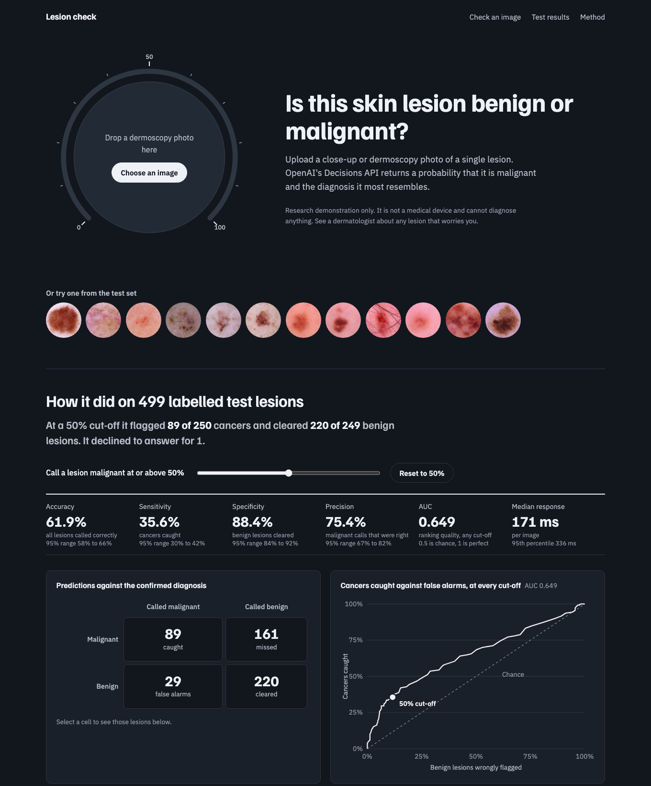

# Lesion check: testing OpenAI's Decisions API on skin-cancer images

An open-source test of OpenAI's new [Decisions API](https://developers.openai.com/api/docs/guides/decisions)
(`POST /v1/decisions`, model `gpt-6-luna`, beta since 6 Oct 2026) on a hard, real-world question:
is this skin lesion benign or malignant?

It includes a classifier, a 500-image evaluation on the public HAM10000 dataset, a head-to-head
comparison with the Responses API on the same model, and a web UI that shows every result.

> **Research demonstration only.** This is not a medical device, it misses most cancers at the
> default cut-off, and it must not be used to make decisions about anyone's health.



A 66-second walkthrough is in [`recordings/lesion-check-demo.mp4`](recordings/lesion-check-demo.mp4).

## What the Decisions API does

You send evidence (text, images or both) plus a list of questions, and get typed answers back
instead of prose:

| Question type | You supply | You get |
|---|---|---|
| `predicate` | a yes/no question | a probability from 0 to 1 |
| `choice` | a fixed list of options | the chosen option and a probability for each |
| `score` | ordered rubric levels | a score and a probability for each level |

This project sends each image once with three questions: a `predicate` on malignancy, a `choice`
over eight lesion types, and a `predicate` checking the picture shows a skin lesion at all.
See [`tools/decisions_client.py`](tools/decisions_client.py).

## Results

500 HAM10000 images (250 benign, 250 malignant), one image per lesion, seeded random sample.
The 50% cut-off was fixed before the run. Ranges are 95% Wilson intervals.

### Decisions API against the Responses API

Same model (`gpt-6-luna`), same images, same instructions. The Responses API run asked for the
same answer as structured JSON at default settings.

| | Decisions API | Responses API |
|---|---|---|
| Median response time | **170 ms** | 3,814 ms |
| 95th-percentile response time | **336 ms** | 7,207 ms |
| Accuracy | 61.9% (58 to 66) | 63.4% (59 to 68) |
| Sensitivity (cancers caught) | 35.6% (30 to 42) | **68.4%** (62 to 74) |
| Specificity (benign cleared) | **88.4%** (84 to 92) | 58.4% (52 to 64) |
| Precision | **75.4%** (67 to 82) | 62.2% (56 to 68) |
| AUC | 0.649 | 0.701 |
| Exact lesion type named | 36.8% | 35.0% |
| Answered | 499 of 500 (1 refusal) | 500 of 500 |
| Billing | input tokens only | input plus about 269 output tokens per image |

What that shows:

- **Speed is the headline.** The Decisions API answered about 22 times faster at the median
  on this task, measured from the same machine with 8 parallel requests.
- **Overall accuracy is the same within error.** The two accuracy ranges overlap almost entirely.
- **The errors differ.** At a 50% cut-off the Decisions API is conservative: few false alarms,
  but it misses 161 of 250 cancers. The Responses API flags far more lesions.
- **Neither is good enough for this job.** An AUC of 0.65 to 0.70 is only modestly better than
  chance (0.5). A general-purpose model looking at one image with one prompt is not a cancer screen.

### Decisions API by diagnosis

| Confirmed diagnosis | Class | Lesions | Called correctly |
|---|---|---|---|
| Melanoma | malignant | 134 | 48% |
| Basal cell carcinoma | malignant | 83 | 22% |
| Squamous cell carcinoma | malignant | 33 | 21% |
| Nevus | benign | 221 | 88% |
| Pigmented benign keratosis | benign | 21 | 86% |
| Vascular lesion | benign | 5 | 100% |
| Dermatofibroma | benign | 2 | 100% |

Full reports: [`results/evaluation.json`](results/evaluation.json) and
[`results/comparison.json`](results/comparison.json).

### Limits of this test

- One sample of 500 images from one dataset, one prompt, one run. No prompt tuning was done.
- The test set is half malignant by design. Real clinics see mostly benign lesions, so precision
  here overstates what you would see in practice.
- 317 of the 500 labels are confirmed by histopathology; the rest by follow-up imaging or expert consensus.
- The Decisions API is in beta and may change.

## Run it yourself

Requires [uv](https://docs.astral.sh/uv/) and an OpenAI API key with Decisions API access.

```bash
uv sync
cp .env.example .env                           # then add OPENAI_API_KEY=sk-...

uv run python -m tools.fetch_isic --n 500      # download the test set (no key needed)
uv run python -m tools.evaluate                # Decisions API run -> results/evaluation.json
uv run python -m tools.compare_responses       # Responses API run -> results/comparison.json
uv run uvicorn app.server:app --port 8642      # open http://localhost:8642
uv run pytest                                  # unit tests
```

Both runs cache every answer under `.tmp/eval/`, so an interrupted run resumes without paying
twice. `--limit 20` runs a small smoke test. The two 500-image runs together cost well under a dollar.

## Layout

- `tools/decisions_client.py`: the questions sent with each image, and response parsing
- `tools/fetch_isic.py`: seeded, one-image-per-lesion sample from the ISIC Archive
- `tools/evaluate.py`, `tools/metrics.py`: evaluation run and statistics
- `tools/compare_responses.py`: the Responses API comparison
- `app/server.py`, `app/static/`: FastAPI server and the UI

## Data and licence

Code is released under the [MIT licence](LICENSE).

Test images come from the HAM10000 collection in the [ISIC Archive](https://www.isic-archive.com/)
(Tschandl, Rosendahl and Kittler, 2018). They are downloaded by `tools/fetch_isic.py` and are not
stored in this repository; check the dataset's own licence terms before reusing them.
